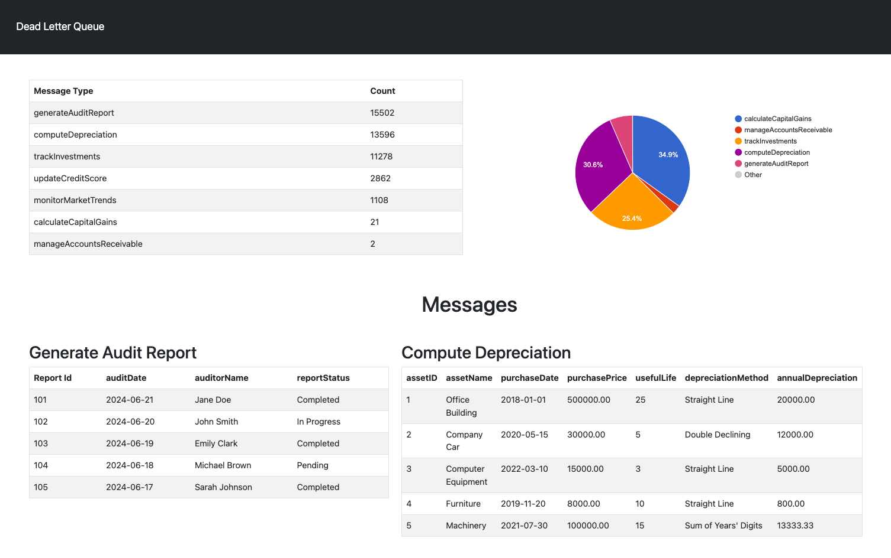

## Dead Letter Queue Inspector
The Dead Letter Queue Inspector is a robust tool designed to analyze and provide insights into the messages present in your Dead Letter Queue (DLQ). This application was built to assist developers, system administrators, and support teams in quickly identifying and resolving issues that result in messages being sent to the DLQ.

## Screenshots  

## Tech Stack  

**Client:** Vue

**Server:** Node

## Features  

- Read from Dead_letter_queue or a queue of your choice
- Write to a queue
- View the messages inside your queues 

## Run Locally  

After cloning the repo, go to the project directory  

~~~bash  
cd RabbitMQ-Reader
~~~

Install dependencies for the reading script 

~~~bash  
npm install
~~~

## Environment Variables  

To run this project, you will need to add the following environment variables to your .env file. You can set the queue name for whichever queue you want to read from. 
~~~
RMQUSERNAME=*username*  
RMQPASSWORD=*password*
QUEUENAME=dead-letter-queue
VUE_APP_QUEUE_NAME=dead-letter-queue
~~~

Reading from the DLQ:
~~~bash  
npm run start-read
~~~

Writing to the DLQ (optional) - only use this script if you want to write a list of messages back to a queue. I created this for testing
~~~bash  
npm run start-write
~~~

## Viewing the DLQ messages

Go to the client directory
~~~bash  
cd client
~~~

Run the frontend
~~~bash  
npm run serve
~~~

## License  

[MIT](https://choosealicense.com/licenses/mit/)
